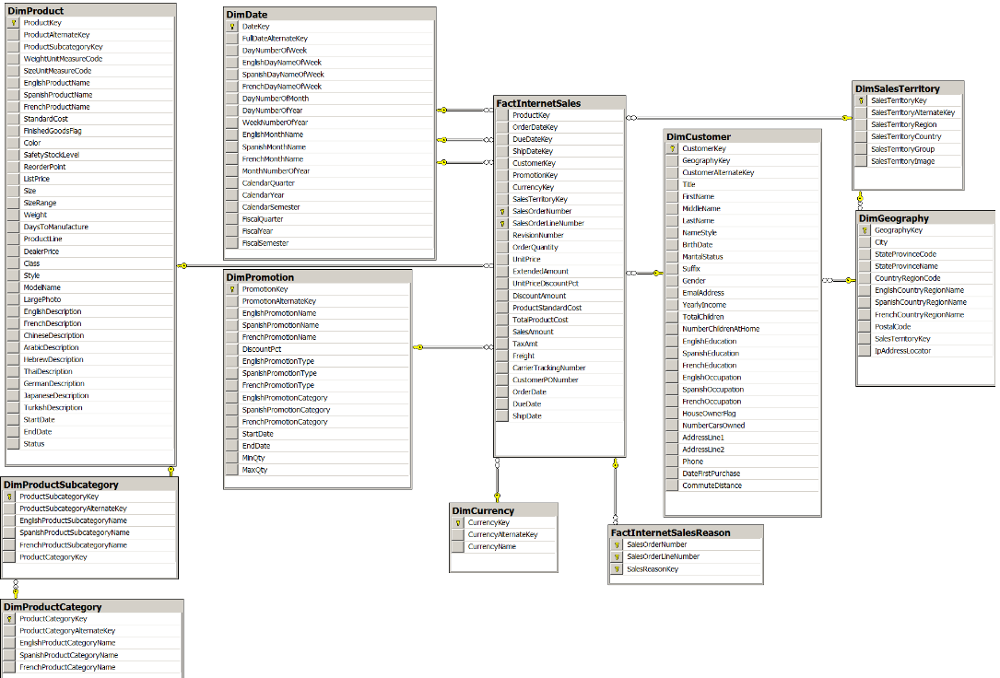

# k8s_example

## [Install prereqs](prereq.md)


## Create Cluster
- `k3d cluster create k8sexample --volume $HOME/k8sexample:/var/lib/rancher/k3s/storage@all -s 1 --servers-memory 4Gb -a 3 --agents-memory 8gb --api-port 6443 -p 8081:80@loadbalancer`
  - storage class: local-path em $HOME/k8sexample
  - 1 control plane
  - 3 worker node
  - Utilização total de memoria: 12 GB
  - port-foward 80 para 8081

## Create Namespace
- `cd ./iac/k3d && terraform init && terraform plan && terraform apply -auto-approve && cd ../.. && kubectl get ns`

## Argo CD
- `helm upgrade --install -f https://raw.githubusercontent.com/vsvale/k8s_example/main/repository/helm-charts/argo-cd/values.yaml argocd argo/argo-cd --namespace cicd --debug --timeout 10m0s`
- Alterado o values para usar ingress (params.server.insecure: true,params.server.rootpath: '/argocd')
- watch kubectl get all -n cicd
- App of Apps: kubectl apply -f https://raw.githubusercontent.com/vsvale/k8s_example/main/example.yaml
- [http://127.0.0.1:8081/argocd/login](http://127.0.0.1:8081/argocd/login)
- user: admin
- password: `kubectl -n cicd get secret argocd-initial-admin-secret -o jsonpath="{.data.password}" | base64 -d  | more`
- caso algo fique como degraded basta deletar, o argo irá recriar novamente. Apenas não delete o cicd/k8sexample

## Kafka
- Strimzi via helm-chart com default values
- metricas para promoetheus
- 3 Broker ephemeral Kafka 3.2.3
- Kafka connect com a image mateushenrique/owshq-kafka-connect-strimzi:3.2.3
- Schema registry 6.1.0
- Cruise control (necessario 3 brokers)
- Kafka Connectors em repository/yamls/ingestion/connectors

## MiniO
- Utilizando o helm chart minio/operator com valores default
- loadbalancer para a UI (9089) do minio e para a API (8686)
- JWT: `kubectl get secret console-sa-secret -o jsonpath="{.data.token}" -n deepstorage| base64 --decode`
- create tenant com TLS disable
- download credentials
- porta 9090 para acessar o console
- create landing and lakehouse buckets

## Spark
- Utilizando spark operator com valores default
- crb para o spark operator

## YugabyteDB
- Utilizando yugabytedb helm chart personalizando user e database:  
```authCredentials:
  ysql:
    user: "plumber"
    password: "PlumberSDE"
    database: "salesdw"
```

## Airflow
- Utilizando helm chart personalizando:
  - imagem: vsvale/vsvale-airflow:2.4.1 [more info](code/airflow)
  - gitsync para https://github.com/vsvale/k8s_example.git
- porta 8787
- necessário criar as conexões:
  - kubernetes Connection: {"name":"kubeconnect", "in-cluster":true} 
  - MiniO Connection: {"aws_access_key_id": "YOURACCESSKEY", "aws_secret_access_key": "YOURSECRETKEY", "host": "http://172.18.0.2:8686"}
  - YugabyteDB Connection: {"name": "yugabytedb_ysql", "host": "yb-tservers.database.svc.cluster.local", "schema": "salesdw", "login": "plumber", "password": "PlumberSDE", "port": "5433"}

## Example
- O estudo de caso utiliza a AdventureWorksLT como source dos dados. Esses dados serão utilizados para alimentar algumas tabelas no DW presente no YugabyteDB.
- O nome do banco de origem é o sampledb, um sqlserver que não contém o CDC habilitado:
```
  - HOST: sampledb.mssql.somee.com
  - USERNAME: vsvale_SQLLogin_1
  - PASSWORD: 41y12q7yhx
  - DATABASE: sampledb
```


- É necessário criar as tabelas no DW, com o seguinte [script](code/yugabytedb/yb-salesdw.sql)



- dimproduct, dimproductcategory, factinternetsales, dimcustomer, dimgeografy terão seus dados oriundos do banco OLTP sampledb
- dimproductsubcategory, dimdate, dimpromotion, dimcurrency, factinternetsalesreason, dimsalesterritory terão seus dados disponibilizados em [csv](code/minio) no bucket landing no minio